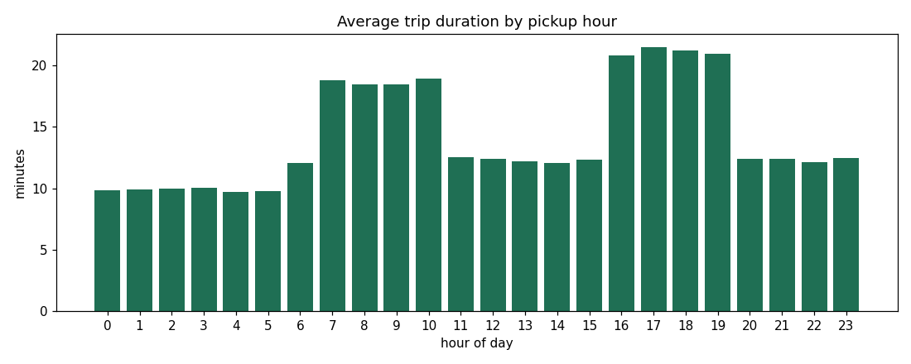
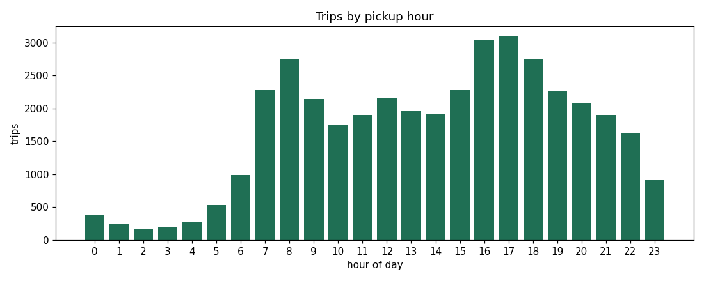
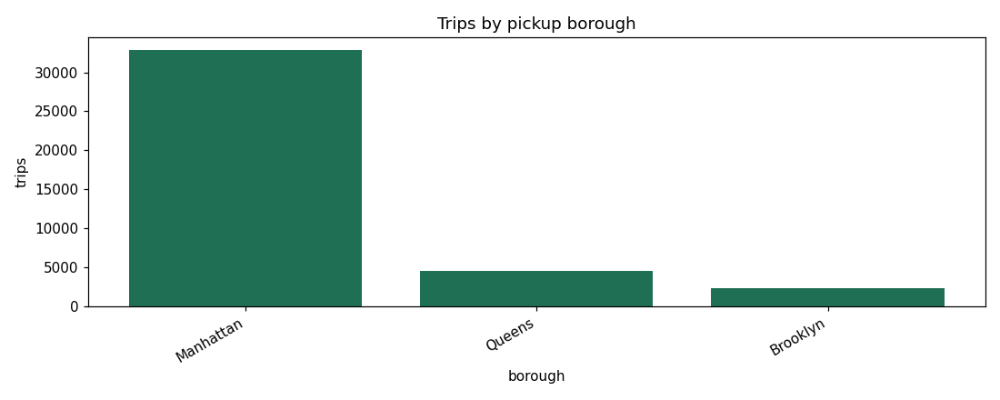
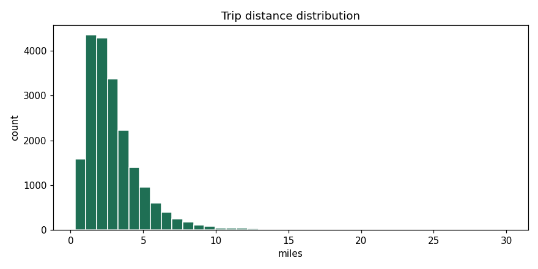
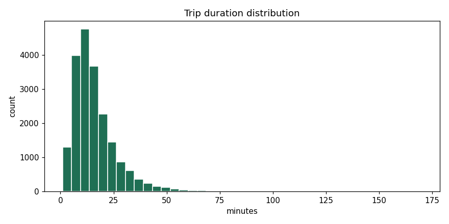

# Exploratory Data Analysis — Findings

Generated by `src/eda.py` on the 40,000-row sample (≈39,600 rows after dropping
zero-distance / zero-duration records). Figures are saved in `docs/figures/`.

## Summary statistics
| Metric | trip_distance (mi) | trip_duration (min) | fare ($) |
|---|---|---|---|
| mean | 2.95 | 16.1 | 13.60 |
| std dev | 1.93 | 10.5 | 7.19 |
| min / max | 0.3 / 30.0 | 1.0 / 170 | −5.0 / 114 |

The negative `fare_amount` minimum and very long max durations are the injected
dirty records — flagged here and removed in the cleaning stage.

## Key patterns
**1. Strong rush-hour effect on duration.** Average trip duration roughly doubles
during congested windows (07–10 ≈ 18–19 min, 16–19 ≈ 21 min) versus off-peak
(≈ 10–12 min), even though average distance barely changes (~2.9 mi all day).
This is the central signal the regression model will learn.

**2. Demand is concentrated midday and at the evening peak.** Trip volume rises
sharply from 07:00 and peaks 16:00–17:00.

**3. Manhattan dominates pickups**, followed by Queens (driven by the airports)
and Brooklyn.

**4. Demand hotspots** (top pickup zones): Times Sq/Theatre District, Penn
Station, Midtown Center, then JFK and LaGuardia airports — consistent with real
NYC demand geography.

**5. Distributions.** Trip distance is right-skewed (most trips < 4 mi); duration
is broader, reflecting the time-of-day congestion spread.

## Implications for modeling
Distance is the obvious primary predictor of duration, but time-of-day features
(`pickup_hour`, an `is_rush_hour` flag) carry real additional signal and should be
included. Payment type and borough show little relationship to duration and are
expected to contribute marginally.
